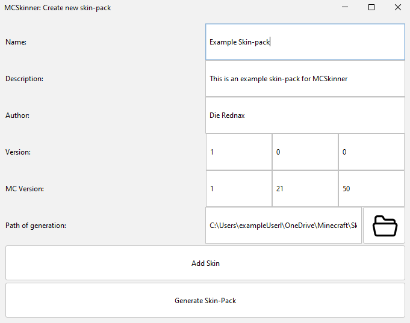
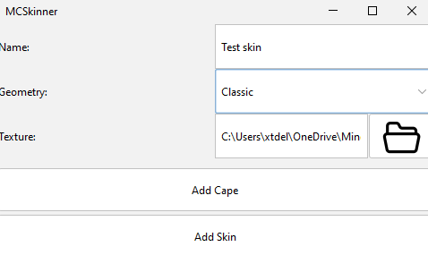

# MCSkinner
MCSkinner is a java program that generates Minecraft bedrock skinpacks. In Minecraft, you can customize you skin by selecting a png file, but you can also create a skinpack that includes all the skins with names and even custom capes!
But this is sometimes a very annoying process, so I made MCSkinner to automate the process. Now you only have to select the content and, it automatically makes the skinpack.

## How to use
1. Download the light or dark themed *.jar file from the [releases page](https://github.com/DieRednax/MCSkinner/releases)
2. Download the [Oracle JDK 21](https://www.oracle.com/java/technologies/javase/jdk21-archive-downloads.html) for your respective operating system
3. Run the .jar file, either by:
   - double-clicking the file or
   - running it from the commandline/terminal with `java -jar <file-name>`
4. Create a new skinpack and fill everything in
   - example:

5. To add a skin to the pack, press "Add Skin" and fill in the skin data
   - example:

6. You can also optionally add a cape texture
7. When you're done add the skin (you can also add more skins) and genrate the skin pack
8. This will generate a folder with the skinpack content. You can import this into Minecraft using 2 different ways
   - Zip up the content with something like [7-Zip](https://7-zip.org/download.html) and rename it *.zip to *.mcpack. Open it to import into Minecraft **or**
   - Copy the folder to `%Local Appdata%\Packages\Microsoft.MinecraftUWP_8wekyb3d8bbwe\LocalState\games\com.mojang\skin_packs` on Windows, `Users/<your username>/Library/Application support/Minecraftpe/Games/com.mojang/skin_packs` on Mac

## Links/Credits

- [File icon](https://www.veryicon.com/icons/miscellaneous/decon/file-open-2.html)
- [FlatLaf](https://www.formdev.com/flatlaf/)
