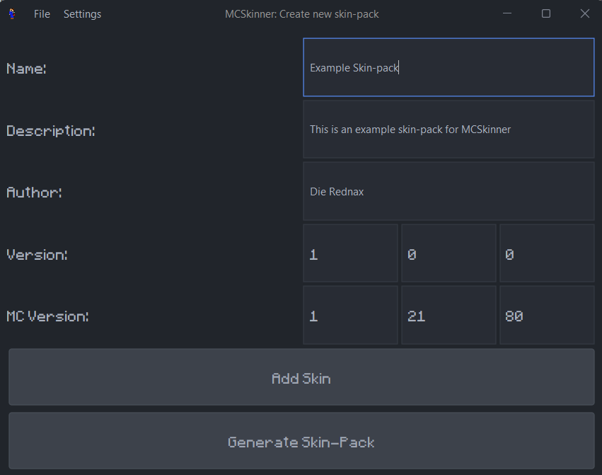
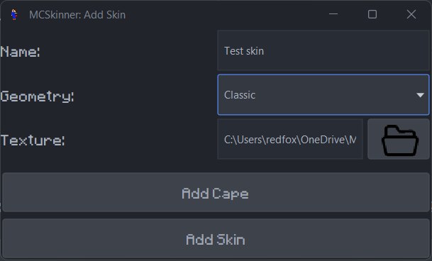

# MCSkinner
MCSkinner is a java program that generates Minecraft bedrock skinpacks. 

In Minecraft, you can customize you skin by selecting a png file, but you can also create a skinpack that includes all the skins with names and even custom capes!
But this is sometimes a very annoying process, so I made MCSkinner to automate it. Now you only have to select the content and it automatically makes the skinpack.

## How to use
*I have a YouTube video coming*
1. Download the *.jar file from the [releases page](https://github.com/DieRednax/MCSkinner/releases) (If you are on Windows, you can download the *.exe file)
2. Download the [Oracle JDK 21](https://www.oracle.com/java/technologies/javase/jdk21-archive-downloads.html) for your respective operating system (if you download the *.exe file, it will redirect you to the correct page)
3. Run the .jar file, either by:
   - double-clicking the file
   - running it from the commandline/terminal with `java -jar <file-path>.jar <parameters>` (replace `<parameters>` with an optional input .mcpack file to import)
4. Run the .exe file, either by:
   - double-clicking the file
   - running it from the commandline with `<file-path> <parameters>` (replace `<parameters>` with an optional input .mcpack file to import)
   - opening a .mcpack file with the .exe file (this will import the .mcpack file into the program)
5. Create a new skinpack and fill everything in
   - example:

6. To add a skin to the pack, press "Add Skin" and fill in the skin data
   - example:

7. You can also optionally add a cape texture
8. When you're done add the skin (you can also add more skins) and press `Genrate Skin-Pack`
9. You will now be presented by a Save As window
10. Choose how you want to save your skinpack:
    - `Import to Minecraft` (Imports the skinpack directly into the game, doesn't work on Mac)
    - `Export to *.mcpack file` (Saves the skinpack to a .mcpack file, which you can share, open to import into the game and import ot MCSkinner to continue editing)
    - `Save to directory` (Saves the skinpack to a directory, like in the first version. This is very raw and is only recommended if you know what you are doing)

## Settings
 MCSkinner has a few different settings to customize your own experience:
#### Appearence:
- Theme: the colors of the app, can be:
  - Light (the default), 
  - Rich Light,
  - Dark, 
  - Rich Dark (what I'm using in the screenshots)
- Font: 5 different fonts:
  - Open Sans (the default)
  - Bradley Hand ITC
  - Algerian
  - Blackadder ITC
  - Minecraft (what I'm using in the screenshots)
- Text size: the size of the text
#### Language:
- Language: the language the every label, button, etc. is in. There are 3 languages:
  - English (the default)
  - Mandarin (Chinese)
  - Afrikaans
- Generate pack as current language: A checkbox to allow the app to generate the pack in your current language (NOTICE: It only adds your language, so if you are Afrikaans and you check the box, you'll have to play Minecraft in Afrikaans)
#### Other:
- Default save location: the default location the app will choose when saving the pack to a raw folder or mcpack
- Default import type: the default type the app will choose when importing a pack

The theme and language settings can also be set to the system default.

## Links/Credits

- [File icon](https://www.veryicon.com/icons/miscellaneous/decon/file-open-2.html)
- [FlatLaf](https://www.formdev.com/flatlaf/)
- [GSON](https://github.com/google/gson)
- [jSystemThemeDetector](https://github.com/Dansoftowner/jSystemThemeDetector)
